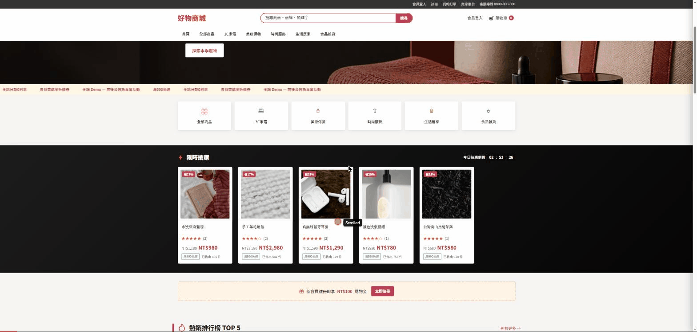

# 好物商城

全端電商作品集 Demo — 前台購物、會員系統、後台管理，全部是真實運作的功能，不是靜態畫面。

視覺與版面參考 PChome、momo 等台灣主流購物網站：密集商品網格、紅色主色調、限時搶購倒數、熱銷排行榜。商品橫跨 3C家電、美妝保養、時尚服飾、生活居家、食品雜貨五大類（共 26 件），全站繁體中文、新台幣計價。



---

## 體驗方式

| | 網址 | 帳號 |
|---|---|---|
| 前台 | `/index.html` | 免登入即可逛與下單 |
| 會員 | `/account/login.html` | `demo@example.com` / `demo1234`（或自行註冊） |
| 賣家後台 | `/admin/login.html` | 密碼 `demo1234` |

還沒部署的話，見下方「快速開始」在本機跑起來。

---

## 功能亮點

**前台**
- 首頁：限時搶購倒數、熱銷排行榜、五大分類商品陳列、新會員優惠券
- 商品列表：分類篩選、排序、關鍵字搜尋
- 商品詳情：規格選擇、星等評價與真實留言、即時庫存狀態、最近瀏覽紀錄
- 購物車：側邊抽屜與完整頁面同步
- 結帳：模擬信用卡付款（含付款成功／失敗兩種情境），運費依台灣零售慣例計算
- 會員：註冊／登入、我的訂單查詢
- 訂單追蹤：下單 → 付款 → 出貨三段式狀態時間軸，出貨自動產生物流追蹤碼

**後台**
- 登入驗證
- 訂單管理：即時看到前台送出的訂單、切換訂單狀態
- 庫存管理：即時調整商品價格與規格庫存

前台下的訂單、後台看到的訂單，是同一筆資料——兩邊操作會即時互相反映。

---

## 技術架構

| 層 | 技術 |
|---|---|
| 前台 | 純 HTML + CSS + Vanilla JS（無框架、無建置步驟） |
| 後端 API | Cloudflare Pages Functions |
| 資料庫 | Cloudflare D1（SQLite） |
| 部署 | Cloudflare Pages 免費方案 |

全站皆落在 Cloudflare 免費額度內：Pages 託管無流量上限、D1 每日 500 萬次讀取。

---

## 專案結構

```
├── public/                # 前台靜態檔案
│   ├── index.html         # 首頁
│   ├── collection.html    # 商品列表
│   ├── product.html       # 商品詳情
│   ├── cart.html          # 購物車
│   ├── checkout.html      # 結帳
│   ├── order-confirmation.html
│   ├── account/           # 會員登入／註冊／我的訂單
│   ├── admin/             # 賣家後台
│   └── assets/
│       ├── css/style.css
│       └── js/             # 各頁邏輯 + 共用元件（api、cart、chrome、product-card…）
│
├── functions/api/          # 後端 API（Cloudflare Pages Functions）
│   ├── products.js / products/[id].js
│   ├── reviews.js
│   ├── orders.js / orders/[id].js
│   ├── customers/           # 會員註冊、登入、我的訂單
│   └── admin/                # 賣家登入、訂單狀態、庫存調整
│
├── schema.sql              # D1 資料表結構 + 種子資料
├── wrangler.toml
└── package.json
```

---

## 快速開始（本機執行）

```bash
npm install
npm run db:init      # 建立本機資料庫並灌入種子資料
npm run dev           # http://localhost:8788
```

## 部署到 Cloudflare

```bash
npx wrangler login
npx wrangler d1 create haowu_mall     # 回傳的 database_id 填進 wrangler.toml
npm run db:init:remote
npx wrangler pages project create haowu-mall
npm run deploy
```

部署後到 Cloudflare Dashboard → Pages 專案 → Settings → Environment variables，設定正式環境的 `ADMIN_PASSWORD` 與 `ADMIN_SECRET`。

---

## 已知限制

- 會員與後台驗證為簡化版（單一密碼、無 Email 驗證/忘記密碼）
- 付款為模擬（`4242 4242 4242 4242` 成功、`4000 0000 0000 0002` 失敗），未串接真實金流
- 商品照片為佔位圖，非真實商品攝影
- 物流追蹤碼、瀏覽人數、已售件數為展示用途，非真實數據
